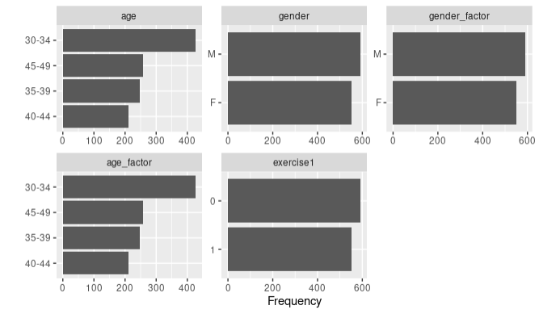
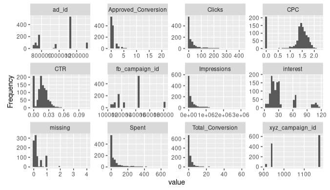
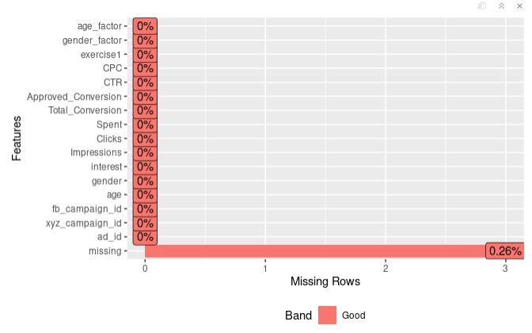
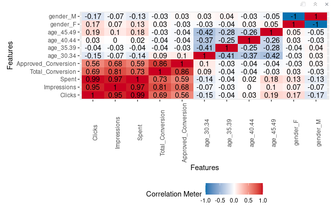

# Data Exploration
```r
library(DataExplorer)
```

## Plot Bar
```r
plot_bar(fb)
```



## Histogram
```r
plot_histogram(fb)
```



## Missing Value
```r
fb$missing <- fb$Total_Conversion/fb$Clicks
plot_missing(fb)
```
> In this case we modify a data that cause `NaN` by divide 0 <br>
> we can observe that the missing rate is 0.26, <br> 
> which means 26% of the data is missing <br>



## Correlation
```r
plot_correlation(fb[,c("age","gender","Clicks","Impressions","Spent","Total_Conversion","Approved_Conversion")])
```


