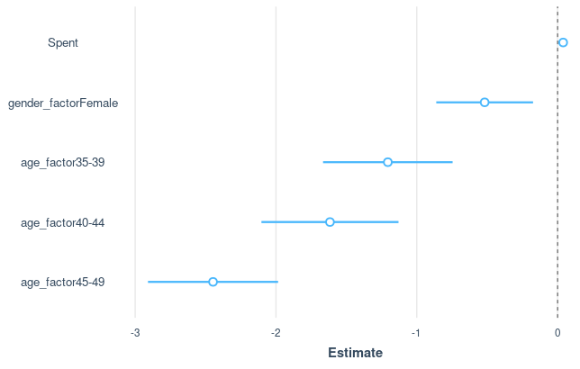

# Linear Regression

## set up
```r
library(jtools) 

fb=read.csv("Facebook_conversion_data.csv")
```

## Linear Regression

```r
relation <- lm(Total_Conversion~Spent,data=fb)
summary(relation)
```

> lm( fitting_formula, dataframe ) <br>
> > **fitting_formula** <br>
> > Yvar ~ Xvar : <br>
> > Yvar is  dependent  (predicted) <br>
> > Xvar is independent (predictor) <br>

```cml
Call:
lm(formula = Total_Conversion ~ Spent, data = fb)

Residuals:
    Min      1Q  Median      3Q     Max 
-12.395  -0.576  -0.007   0.066  35.118 

Coefficients:
            Estimate Std. Error t value Pr(>|t|)    
(Intercept) 0.933613   0.106096     8.8   <2e-16 ***
Spent       0.037422   0.001051    35.6   <2e-16 ***
---
Signif. codes:  0 ‘***’ 0.001 ‘**’ 0.01 ‘*’ 0.05 ‘.’ 0.1 ‘ ’ 1

Residual standard error: 3.088 on 1141 degrees of freedom
Multiple R-squared:  0.5262,	Adjusted R-squared:  0.5258 
F-statistic:  1267 on 1 and 1141 DF,  p-value: < 2.2e-16
```

## Prediction
```r
a <- data.frame(Spent = c(170, 280, 390))   # let Spent = c(170, 280, 390)
result <-  predict(relation,a)    # use the relation we set above
result
```
> predict( object, newdata, interval ) <br>
> >  **object** : the class inheriting from 'lm' <br>
> > **newdata **: input data to predict <br>
> > **interval**: type of interval calculation <br>
```cml
        1         2         3 
 7.295392 11.411837 15.528281 
```
predict the corresponding Total_Conversion
using given values of Spent ( c(170, 280, 390) )

## Visualize

### plot()
```r
# Plot the chart.
plot( fb$Spent, fb$Total_Conversion, 
      col = "black", # color
      main = "Spent and Conversion Regression", # Topic
      abline(lm(Total_Conversion~Spent,data=fb)),  # Add the conversion line
      xlab = "Amount spent on campaign", # x-Label
      ylab = "Total number of conversions") # y-Label
```


### ggplot
```r
#plot the data together with the fitted line
ggplot(fb, 
    aes(Spent, Total_Conversion)) # select the datas
    + geom_point() # create scatter points
    + geom_smooth(method = "lm") # Add the conversion line
    + labs(x = "Amount spent on campaign", y = "Total number of conversions") # xy-Labels
```


## Multiple Regressors
```r
uni_gen <- unique(fb$gender)
fb$gender_factor=factor(fb$gender,
                        levels=uni_gen, 
                        labels = c("Male", "Female")
                        )

uni_age <- unique(fb$age)
fb$age_factor=factor(fb$age,
                        levels=uni_age, 
                        labels = c("30-34", "35-39", "40-44", "45-49")
                        )
```

```r
relation <- lm(Total_Conversion ~ Spent + gender_factor + age_factor, data=fb)
summary(relation)
```

```cml
Call:
lm(formula = Total_Conversion ~ Spent + gender_factor + age_factor, 
    data = fb)

Residuals:
    Min      1Q  Median      3Q     Max 
-11.471  -1.172  -0.115   0.870  32.338 

Coefficients:
                     Estimate Std. Error t value Pr(>|t|)    
(Intercept)          2.172491   0.165562  13.122  < 2e-16 ***
Spent                0.039831   0.001025  38.857  < 2e-16 ***
gender_factorFemale -0.517767   0.175200  -2.955  0.00319 ** 
age_factor35-39     -1.205487   0.234460  -5.142 3.21e-07 ***
age_factor40-44     -1.616443   0.248115  -6.515 1.09e-10 ***
age_factor45-49     -2.446888   0.235531 -10.389  < 2e-16 ***
---
Signif. codes:  0 ‘***’ 0.001 ‘**’ 0.01 ‘*’ 0.05 ‘.’ 0.1 ‘ ’ 1

Residual standard error: 2.932 on 1137 degrees of freedom
Multiple R-squared:  0.5741,	Adjusted R-squared:  0.5722 
F-statistic: 306.5 on 5 and 1137 DF,  p-value: < 2.2e-16
```

### visualize
```r
plot_coefs(relation)
```

