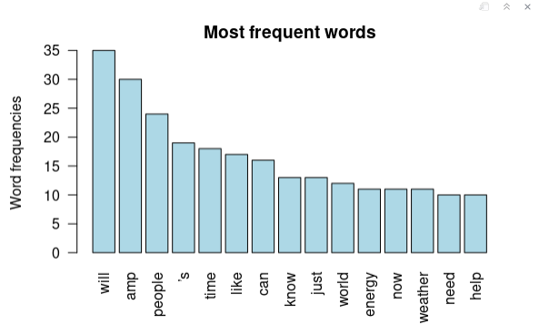

# Word Cloud

## Load Packages
```r
library(rtweet) #get tweet from Twitter API
library(dplyr)  #summarise
library(wordcloud) #package to generate a word cloud 
library(tm)
```

## Authantication
```r
# twitter_tokens <- 
#  create_token(app = "S326",
#               consumer_key = "Z9yJu2xgTrcTqCHJvOkn8vz6E",
#               consumer_secret = "H9IySsPPZE5GbjdSJYNyzprS80LfvXuuOTCOLSu0IjkpCUW2zo")
```

## Data Collection
```r
#climate_tweets <- search_tweets("climate change", n = 200, include_rts = FALSE)
#saveRDS(climate_tweets, file = "climate_tweets.rds")
```

## read RDS file
```r
climate_tweets<-readRDS(file = "climate_tweets.rds")
```

## Corpus (語料庫)
clean up the data(string) into useful word sets
1. remove punctuation
2. remove meaningless words
3. reduce spaces

### Generate corpus
```r
temp=VectorSource(climate_tweets$text)
corpus <- Corpus(temp) #Corpus is a function to transform vectors into a corpus 
inspect(corpus[1:5])
```
```cml
<<SimpleCorpus>>
Metadata:  corpus specific: 1, document level (indexed): 0
Content:  documents: 5

[1] Always thought this. Free energy for cars doesn’t make a profit much nor promote climate change. https://t.co/7sO4H3Ryk5                                                                                                                                            
[2] @ISASaxonists @VeronicaSixsmi1 Climate change hahahahahaha                                                                                                                                                                                                          
[3] @Mollyploofkins No, more worried about climate change. It's killing more, and costing more than Trump.                                                                                                                                                              
[4] @guy_courier @k_monty22 Climate change 👀😳                                                                                                                                                                                                                         
[5] Given this unbelievable evil, the growing trend to global governance, and their push for climate change control; is there any doubt the end times are upon us?\n\nBelieve upon the Name of Jesus Christ and repent while there's still time. https://t.co/qKcNtGr1DL
```

### Lower Case
```r
corpus_l <- tm_map(corpus, content_transformer(tolower))
inspect(corpus_l[1:5])
```
```cml
Warning: transformation drops documents
<<SimpleCorpus>>
Metadata:  corpus specific: 1, document level (indexed): 0
Content:  documents: 5

[1] always thought this. free energy for cars doesn’t make a profit much nor promote climate change. https://t.co/7so4h3ryk5                                                                                                                                            
[2] @isasaxonists @veronicasixsmi1 climate change hahahahahaha                                                                                                                                                                                                          
[3] @mollyploofkins no, more worried about climate change. it's killing more, and costing more than trump.                                                                                                                                                              
[4] @guy_courier @k_monty22 climate change 👀😳                                                                                                                                                                                                                         
[5] given this unbelievable evil, the growing trend to global governance, and their push for climate change control; is there any doubt the end times are upon us?\n\nbelieve upon the name of jesus christ and repent while there's still time. https://t.co/qkcntgr1dl
```

### Remove Punctuation
remove all symbols except "\"
```r
corpus_p <- tm_map(corpus, removePunctuation)
inspect(corpus_p[1:5])
```
```cml
Warning: transformation drops documents
<<SimpleCorpus>>
Metadata:  corpus specific: 1, document level (indexed): 0
Content:  documents: 5

[1] Always thought this Free energy for cars doesn’t make a profit much nor promote climate change httpstco7sO4H3Ryk5                                                                                                                                        
[2] ISASaxonists VeronicaSixsmi1 Climate change hahahahahaha                                                                                                                                                                                                 
[3] Mollyploofkins No more worried about climate change Its killing more and costing more than Trump                                                                                                                                                         
[4] guycourier kmonty22 Climate change 👀😳                                                                                                                                                                                                                  
[5] Given this unbelievable evil the growing trend to global governance and their push for climate change control is there any doubt the end times are upon us\n\nBelieve upon the Name of Jesus Christ and repent while theres still time httpstcoqKcNtGr1DL
```

### Remove Numbers
```r
corpus_n <- tm_map(corpus, removeNumbers)
inspect(corpus_n[1:5])
```
```cml
Warning: transformation drops documents
<<SimpleCorpus>>
Metadata:  corpus specific: 1, document level (indexed): 0
Content:  documents: 5

[1] Always thought this. Free energy for cars doesn’t make a profit much nor promote climate change. https://t.co/sOHRyk                                                                                                                                               
[2] @ISASaxonists @VeronicaSixsmi Climate change hahahahahaha                                                                                                                                                                                                          
[3] @Mollyploofkins No, more worried about climate change. It's killing more, and costing more than Trump.                                                                                                                                                             
[4] @guy_courier @k_monty Climate change 👀😳                                                                                                                                                                                                                          
[5] Given this unbelievable evil, the growing trend to global governance, and their push for climate change control; is there any doubt the end times are upon us?\n\nBelieve upon the Name of Jesus Christ and repent while there's still time. https://t.co/qKcNtGrDL
```

### Remove Stop Words
remove meaning less words in "english", ex. 'the', 'for', 'is', 'a', 'at', 'on', etc.
```r
cleanset <- tm_map(corpus, removeWords, stopwords('english'))
inspect(cleanset[1:5])
```
```cml
Warning: transformation drops documents<<SimpleCorpus>>
Metadata:  corpus specific: 1, document level (indexed): 0
Content:  documents: 5

[1] Always thought . Free energy  cars doesn’t make  profit much  promote climate change. https://t.co/7sO4H3Ryk5                                                                                               
[2] @ISASaxonists @VeronicaSixsmi1 Climate change hahahahahaha                                                                                                                                                  
[3] @Mollyploofkins No,  worried  climate change. It's killing ,  costing   Trump.                                                                                                                              
[4] @guy_courier @k_monty22 Climate change 👀😳                                                                                                                                                                 
[5] Given  unbelievable evil,  growing trend  global governance,   push  climate change control;    doubt  end times  upon us?\n\nBelieve upon  Name  Jesus Christ  repent   still time. https://t.co/qKcNtGr1DL
```

### Remove User-defined Word
remove words that you want
```r
cleanset2 <- tm_map(cleanset, removeWords, c("climate ", "change ")) 
inspect(cleanset2[1:5])
```
```cml
Warning: transformation drops documents
<<SimpleCorpus>>
Metadata:  corpus specific: 1, document level (indexed): 0
Content:  documents: 5

[1] Always thought . Free energy  cars doesn’t make  profit much  promote change. https://t.co/7sO4H3Ryk5                                                                                        
[2] @ISASaxonists @VeronicaSixsmi1 Climate hahahahahaha                                                                                                                                          
[3] @Mollyploofkins No,  worried  change. It's killing ,  costing   Trump.                                                                                                                       
[4] @guy_courier @k_monty22 Climate change 👀😳                                                                                                                                                  
[5] Given  unbelievable evil,  growing trend  global governance,   push  control;    doubt  end times  upon us?\n\nBelieve upon  Name  Jesus Christ  repent   still time. https://t.co/qKcNtGr1DL
```

### Do a PipeLine to all the operators above
```r
cleanset = corpus %>%
  tm_map(tolower) %>%
  tm_map(removeNumbers) %>%
  tm_map(removePunctuation) %>%
  tm_map(removeWords,c("climate","change")) %>%
  tm_map(removeWords,stopwords('english')) 
  
  inspect(cleanset[1:5])
```
```cml
<<SimpleCorpus>>
Metadata:  corpus specific: 1, document level (indexed): 0
Content:  documents: 5

[1] always thought  free energy  cars doesn’t make  profit much  promote   httpstcosohryk                                                                                                     
[2] isasaxonists veronicasixsmi   hahahahahaha                                                                                                                                                
[3] mollyploofkins   worried     killing   costing   trump                                                                                                                                    
[4] guycourier kmonty   👀😳                                                                                                                                                                  
[5] given  unbelievable evil  growing trend  global governance   push    control    doubt  end times  upon us\n\nbelieve upon  name  jesus christ  repent  theres still time httpstcoqkcntgrdl
```

> Warnings are normal, due to using Corpus(), instead of VCorpus()
  
## Term Document Matrix (檢索文件矩陣)

```r
tdm <- TermDocumentMatrix(cleanset) # this is still a list
tdm <- as.matrix(tdm) # transform the list into a matrix
tdm[1:10, 1:20] # the rownames of this matrix are the terms.
```
```cml
                Docs
Terms            1 2 3 4 5 6 7 8 9 10 11 12 13 14 15 16 17 18 19 20
  always         1 0 0 0 0 0 0 0 0  0  0  0  0  0  0  0  0  0  0  0
  cars           1 0 0 0 0 0 0 0 0  0  0  0  0  0  0  0  0  0  0  0
  doesn’t        1 0 0 0 0 0 0 0 0  0  0  0  0  0  0  0  0  0  0  0
  energy         1 0 0 0 0 0 0 0 0  0  0  0  0  0  0  0  0  0  0  0
  free           1 0 0 0 0 0 0 0 0  0  0  0  0  0  0  0  0  0  0  0
  httpstcosohryk 1 0 0 0 0 0 0 0 0  0  0  0  0  0  0  0  0  0  0  0
  make           1 0 0 0 0 0 0 0 0  0  0  0  0  0  1  0  0  0  0  0
  much           1 0 0 0 0 0 0 0 0  0  0  0  0  0  0  0  0  0  0  0
  profit         1 0 0 0 0 0 0 0 0  0  0  0  0  0  0  0  0  0  0  0
  promote        1 0 0 0 0 0 0 0 0  0  0  0  0  0  0  0  0  0  0  0
```

## Word Frequentcy
```r
temp=rowSums(tdm) # sum up the row (now its a list again)
words <- sort(temp,decreasing=TRUE) # sort in decreasing order

# make it a dataframe
# word(str) : freq(int)
df <- data.frame(word = names(words),freq=words) 
head(df, 10)
```
```cml
         word freq
will     will   35
amp       amp   30
people people   24
’s         ’s   19
time     time   18
like     like   17
can       can   16
know     know   13
just     just   13
world   world   12
```

### Generate Barplot
```r
barplot(df[1:10,]$freq, 
        las = 2, 
        names.arg = df[1:10,]$word,
        col ="lightblue", 
        main ="Most frequent words",
        ylab = "Word frequencies")
```


## Word Cloud
```r
set.seed(222) # this is just a number to keep the graph fixed.
wordcloud(words = df$word,
          freq = df$freq,
          max.words = 100, # max number of words
          random.order = F,
          min.freq = 10, # no need to include infrequent words
          colors = brewer.pal(8, 'Dark2'),
          scale = c(5, 0.3),
          rot.per = 0.7)
```


```r
set.seed(222) # this is just a number to keep the graph fixed.
wordcloud(words = df$word,
          freq = df$freq,
          max.words = 100, # max number of words
          random.order = F,
          min.freq = 20, # no need to include infrequent words
          colors = brewer.pal(8, 'Dark2'),
          scale = c(5, 0.3),
          rot.per = 0.7)
```

