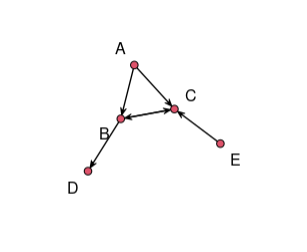
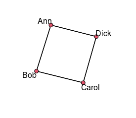
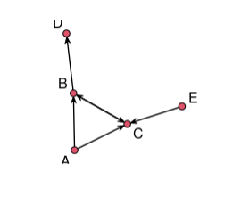
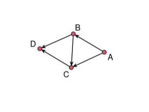

# Network

## Load Package
```r
library("statnet") # this is a package for network analysis.
```

 ## Network  Representation with Adjacency Matrix
 1. generate the Adjacency Matrix
 2. set it as a network
 3. gplot() to display the network
 
 ### EX1
 ```r
 # 1
netmat1 <- rbind(c(0,1,1,0,0),  c(0,0,1,1,0),  c(0,1,0,0,0),  c(0,0,0,0,0),  c(0,0,1,0,0))  
rownames(netmat1) <- c("A","B","C","D","E") 
colnames(netmat1) <- c("A","B","C","D","E")  
 
 # 2
 net1 <- network(netmat1,matrix.type="adjacency") 
 summary(net1)
 
 # 3
 gplot(net1,   displaylabels = TRUE)
 ```
 ```cml
 Network attributes:
  vertices = 5
  directed = TRUE
  hyper = FALSE
  loops = FALSE
  multiple = FALSE
  bipartite = FALSE
 total edges = 6 
   missing edges = 0 
   non-missing edges = 6 
 density = 0.3 

Vertex attributes:
  vertex.names:
   character valued attribute
   5 valid vertex names

No edge attributes

Network adjacency matrix:
  A B C D E
A 0 1 1 0 0
B 0 0 1 1 0
C 0 1 0 0 0
D 0 0 0 0 0
E 0 0 1 0 0
 ```

 
 ### EX2
 ```r
# 1 
netmat1 <- rbind(c(0,1,0,1),  c(1,0,1,0),  c(0,1,0,1),  c(1,0,1,0))  
rownames(netmat1) <- c("Ann","Bob","Carol","Dick") 
colnames(netmat1) <- c("Ann","Bob","Carol","Dick")

# 2
net1 <- network(netmat1,matrix.type="adjacency",directed = FALSE)
summary(net1)

# 3
gplot(net1,   displaylabels = TRUE,gmode = "graph") 

summary(net1) 
 ```
 ```cml
Network attributes:
  vertices = 4
  directed = FALSE
  hyper = FALSE
  loops = FALSE
  multiple = FALSE
  bipartite = FALSE
 total edges = 4 
   missing edges = 0 
   non-missing edges = 4 
 density = 0.6666667 

Vertex attributes:
  vertex.names:
   character valued attribute
   4 valid vertex names

No edge attributes

Network adjacency matrix:
      Ann Bob Carol Dick
Ann     0   1     0    1
Bob     1   0     1    0
Carol   0   1     0    1
Dick    1   0     1    0
 ```

 
 ## Network  Representation with EdgeList
 1. create a EdgeList
 2. set it as network
 3. gplot() to display the network
 
 ### EX1
 ```r
 # 1
netmat2 <- rbind(c(1,2),  c(1,3),  c(2,3),  c(2,4),  c(3,2),  c(5,3))
 
# 2
net2 <- network(netmat2,matrix.type="edgelist")  
network.vertex.names(net2) <- c("A","B","C","D","E")  
summary(net2)

# 3
gplot(net2,   displaylabels = TRUE) 
 ```
 ``` cml
 Network attributes:
  vertices = 5
  directed = TRUE
  hyper = FALSE
  loops = FALSE
  multiple = FALSE
  bipartite = FALSE
 total edges = 6 
   missing edges = 0 
   non-missing edges = 6 
 density = 0.3 

Vertex attributes:
  vertex.names:
   character valued attribute
   5 valid vertex names

No edge attributes

Network adjacency matrix:
  A B C D E
A 0 1 1 0 0
B 0 0 1 1 0
C 0 1 0 0 0
D 0 0 0 0 0
E 0 0 1 0 0
 ```
 

 
 ### EX2
 ```r
# 1
netmat2 <- rbind(c("Ann","Bob"),  c("Ann","Carol"),  c("Bob","Carol"),  c("Bob","Dick"),  c("Carol","Dick")) 

# 2
net2 <- network(netmat2,matrix.type="edgelist")  
network.vertex.names(net2) <- c("A","B","C","D","E")  
summary(net2) 

# 3
gplot(net2,   displaylabels = TRUE) 
 ```
 ```cml
 Network attributes:
  vertices = 4
  directed = TRUE
  hyper = FALSE
  loops = FALSE
  multiple = FALSE
  bipartite = FALSE
 total edges = 5 
   missing edges = 0 
   non-missing edges = 5 
 density = 0.4166667 

Vertex attributes:
  vertex.names:
   character valued attribute
   4 valid vertex names

No edge attributes

Network adjacency matrix:
  A B C D
A 0 1 1 0
B 0 0 1 1
C 0 0 0 1
D 0 0 0 0
 ```

